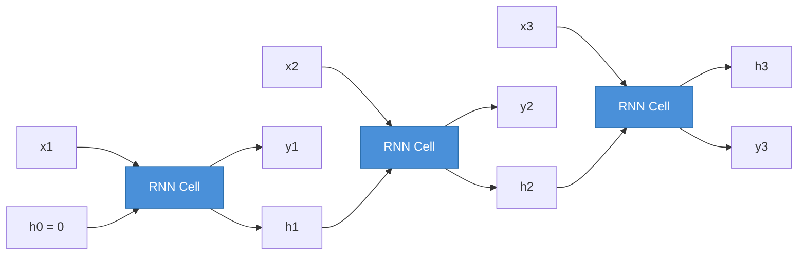
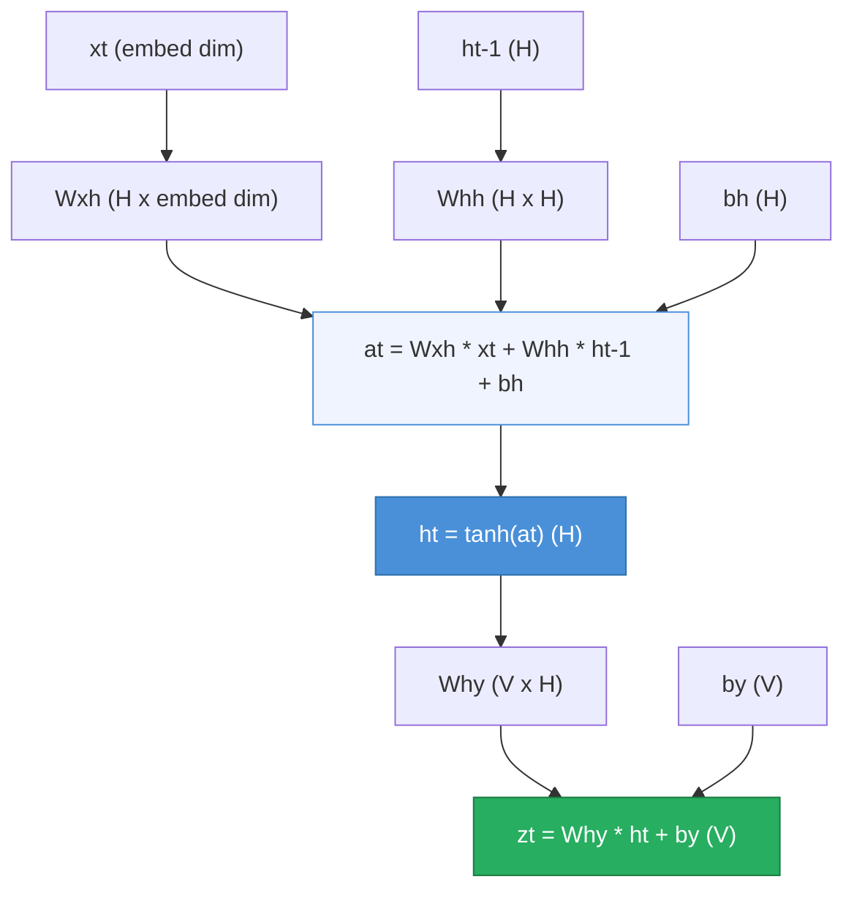
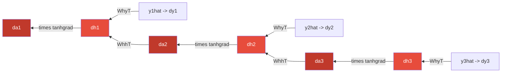
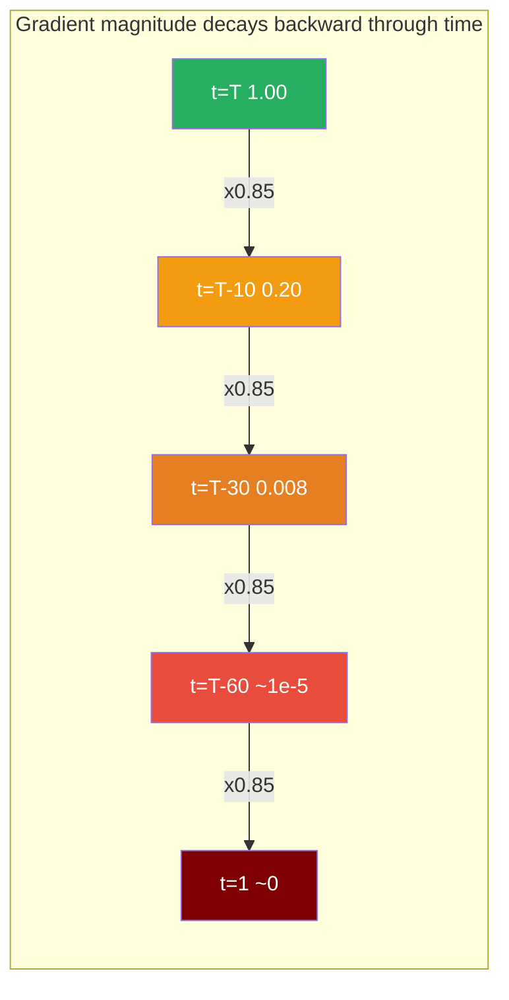
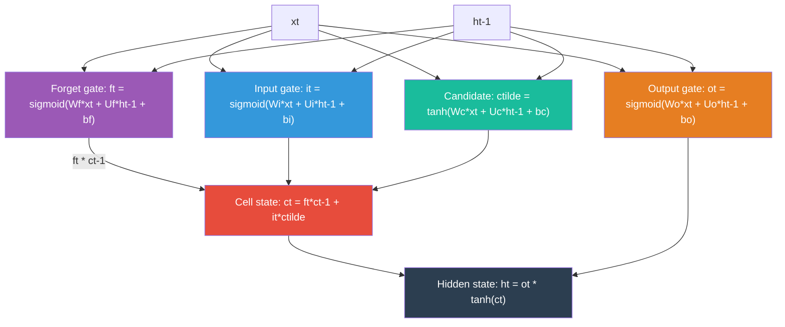

# A05 — Recurrent Neural Networks from Scratch

## Overview

Feedforward networks and CNNs process one input at a time — they have no sense of what came before. The moment your data has order, that matters. A sentence is not a bag of words. The word "bank" means something completely different after "river" than after "savings". A character only makes sense in the context of the characters that preceded it.

This assignment builds a character-level language model from scratch. You will implement the Elman RNN cell and the LSTM cell manually inside PyTorch `nn.Module` classes — `nn.RNN`, `nn.LSTM`, and `nn.GRU` are forbidden. PyTorch's autograd handles the backward pass, but you must write every forward equation yourself.

The dataset is **tinyshakespeare** — Karpathy's 1.1MB collection of Shakespeare plays, the same corpus used in "The Unreasonable Effectiveness of Recurrent Neural Networks." Given a sequence of characters, predict the next one. After training, your model generates text by sampling from its own predictions. You will watch it go from random noise to something that looks like English, and with the LSTM, to something that occasionally sounds like a confused but enthusiastic playwright.

The task is chosen because the output is human-readable. You can look at generated text and immediately understand what the model has and has not learned — that feedback loop is more valuable than any number on a held-out set.

This assignment sits immediately before A06 (Attention from Scratch). When you finish here, you will have seen exactly what RNNs can and cannot do, and that experience is what makes the motivation for attention mechanisms concrete rather than abstract.

---

## Theory

### Why feedforward networks fail on sequences

A feedforward network maps one fixed-size input to one output. It has no memory of what it processed before. For sequential data, this is a fundamental limitation — not a missing feature you can add on top, but a structural incompatibility.

You could try to feed the whole sequence as one flattened input, but this has three problems. First, the input size is fixed — a network expecting 100 characters cannot handle 101. Second, there is no parameter sharing across time: a pattern learned at position 3 is not reused at position 7, even if the pattern is identical. Third, the parameter count scales with sequence length, which is untenable for long sequences.

RNNs solve this with a single idea: a hidden state $h_t \in \mathbb{R}^H$ that summarises everything the network has seen up to time $t$. The same weights are applied at every time step, so the network generalises across temporal positions exactly the way a CNN generalises across spatial positions.



The three blue boxes are the same weights applied repeatedly. Unrolling is a visualisation device — the actual parameters are shared across all time steps.

### The Elman RNN cell

At each time step $t$, the RNN performs three operations:

$$a_t = W_{xh}\, x_t + W_{hh}\, h_{t-1} + b_h$$
$$h_t = \tanh(a_t)$$
$$z_t = W_{hy}\, h_t + b_y$$

where $x_t$ is the embedded character at step $t$, $h_{t-1}$ is the hidden state carried from the previous step, and $z_t$ is a vector of unnormalised logits over the vocabulary. The pre-activation $a_t$ mixes the current input with memory of the past; $\tanh$ squashes this into the range $(-1, 1)$.



**Parameter shapes** — fix this table in your head before writing code:

| Parameter | Shape | Role |
|---|---|---|
| $W_{xh}$ | $(H \times E)$ | input embedding → hidden pre-activation |
| $W_{hh}$ | $(H \times H)$ | previous hidden state → hidden pre-activation |
| $b_h$ | $(H,)$ | hidden bias |
| $W_{hy}$ | $(V \times H)$ | hidden state → vocabulary logits |
| $b_y$ | $(V,)$ | output bias |

$V$ is vocabulary size (~65 for tinyshakespeare), $H$ is hidden dimension, $E$ is embedding dimension (`embed_dim`).

### Xavier initialisation and the symmetry problem

All weight matrices are initialised with Xavier (Glorot) initialisation:

$$W \sim \mathcal{N}\!\left(0,\; \frac{2}{n_{\text{in}} + n_{\text{out}}}\right)$$

This keeps the variance of activations and gradients stable as information flows through layers and through time — preventing signals from exploding or vanishing at initialisation before training even begins.

Why not initialise to zero? If all weights are equal, every hidden unit computes the same value and receives the same gradient. They remain identical throughout training and the extra hidden units are wasted. This is the **symmetry problem** — random initialisation breaks it by ensuring every unit starts in a different part of the loss landscape.

Biases are initialised to zero; they do not participate in symmetry breaking.

### Loss: cross-entropy and perplexity

Character-level language modelling is a classification problem at every time step: given the sequence so far, which of the $V$ characters comes next? The logits $z_t$ are converted to a probability distribution with softmax:

$$p_t = \text{softmax}(z_t) = \frac{e^{z_t}}{\sum_{j=1}^{V} e^{z_{t,j}}}$$

The cross-entropy loss for the true next character $c_t$ is:

$$\mathcal{L}_t = -\log p_{t,c_t}$$

The total loss over the sequence is $\mathcal{L} = \sum_{t=1}^{T} \mathcal{L}_t$.

The gradient of cross-entropy with respect to the logits is clean:

$$\delta^y_t = \frac{\partial \mathcal{L}_t}{\partial z_t} = p_t - \mathbf{e}_{c_t}$$

where $\mathbf{e}_{c_t}$ is the one-hot vector for the true character. This is the predicted distribution minus the target distribution — the output error signal that starts the backward pass.

**Perplexity** is the standard evaluation metric for language models:

$$\text{PPL} = \exp\!\left(\frac{1}{T} \sum_{t=1}^{T} \mathcal{L}_t\right)$$

A perplexity of $V$ (vocabulary size, ~65) means the model is no better than random. A perplexity of 1 means perfect prediction. A well-trained character-level LSTM on Shakespeare reaches PPL around 3–6, meaning the model is effectively choosing between 3–6 plausible next characters at each step.

### Backpropagation Through Time (BPTT)

Because all weights are shared across time steps, gradients accumulate from every position:

$$\frac{\partial \mathcal{L}}{\partial \theta} = \sum_{t=1}^{T} \frac{\partial \mathcal{L}_t}{\partial \theta}$$

The backward pass flows through the unrolled computation graph. The key complication compared to a feedforward network: the hidden state $h_t$ contributes to the loss in **two** ways — directly through the output $z_t = W_{hy} h_t + b_y$, and indirectly through the next hidden state $h_{t+1}$ via the recurrent connection. Missing the second contribution is the most common BPTT bug.

The error signals at each step $t$, working backward from $t = T$:

$$\delta^y_t = p_t - \mathbf{e}_{c_t} \qquad \text{(output error, shape } V \text{)}$$

$$\delta^h_t = W_{hy}^\top \delta^y_t \;+\; W_{hh}^\top \delta^a_{t+1} \qquad \text{(hidden error, shape } H \text{)}$$

$$\delta^a_t = \delta^h_t \odot \tanh'(a_t) \qquad \text{(pre-activation error, shape } H \text{)}$$

where $\tanh'(a_t) = 1 - \tanh^2(a_t)$ applied element-wise, and $\delta^a_{T+1} = \mathbf{0}$.



Each red node receives gradient from two sources: its own output (via $W_{hy}^\top$) and the next step's pre-activation error (via $W_{hh}^\top$). PyTorch autograd computes this automatically — but you must write the correct forward pass so that the computation graph is correct.

**Truncated BPTT:** Backpropagating through 1,000 characters at once is memory-intensive and slow. In practice, the sequence is split into chunks (e.g. 100 characters). After each chunk, gradients are computed and the hidden state is **detached** from the graph before being passed to the next chunk. This cuts the gradient graph at chunk boundaries while allowing information to flow forward in the hidden state. In PyTorch: `h = h.detach()`.

### Vanishing and exploding gradients

Consider the gradient signal flowing back from step $T$ to step $t$. Ignoring the output contribution at each step, the dominant term is:

$$\delta^a_t \;\propto\; \left(W_{hh}^\top\right)^{T-t} \delta^a_T \;\cdot\; \prod_{\tau=t}^{T} \tanh'(a_\tau)$$

Two compounding factors determine whether this survives:

1. **Repeated multiplication by $W_{hh}^\top$:** if the largest eigenvalue of $W_{hh}$ is $> 1$, the gradient norm grows exponentially → **exploding gradients**, training diverges. If $< 1$, it shrinks exponentially → **vanishing gradients**, early time steps receive no learning signal.

2. **Repeated multiplication by $\tanh'(a)$:** the tanh derivative lies in $(0, 1)$ — always less than 1. Over hundreds of steps, this alone can reduce the gradient to numerical zero.



The practical consequence: a vanilla RNN trained on Shakespeare cannot learn that an opening parenthesis needs a closing one fifty characters later. It simply cannot carry that information reliably through the hidden state for that long.

### Gradient clipping

Gradient clipping prevents the exploding case. After computing all gradients, compute the global L2 norm across all parameters:

$$\mathcal{N} = \sqrt{\sum_i \lVert \nabla_{\theta_i} \mathcal{L} \rVert_2^2}$$

If $\mathcal{N} > \tau$ (threshold, typically 1–5), rescale all gradients proportionally:

$$\nabla_{\theta_i} \leftarrow \nabla_{\theta_i} \cdot \frac{\tau}{\mathcal{N}}$$

Direction is preserved; only magnitude is capped. In PyTorch: `torch.nn.utils.clip_grad_norm_(model.parameters(), max_norm=5.0)`. This is one line of code and is standard in every RNN training loop.

Clipping addresses the exploding case only. The vanishing case — where early time steps receive no gradient — requires an architectural fix.

### LSTM: fixing the root cause

The LSTM (Hochreiter & Schmidhuber, 1997) introduces a second state vector — the **cell state** $c_t$ — whose gradient path through time is protected from repeated matrix multiplication. This is the Constant Error Carousel.

The cell state is updated additively:

$$c_t = f_t \odot c_{t-1} + i_t \odot \tilde{c}_t$$

The gradient of $c_t$ with respect to $c_{t-1}$ is simply $f_t$ — a learned element-wise scalar, not a full matrix multiply through a saturating nonlinearity. When $f_t \approx 1$, the gradient passes through nearly unchanged, enabling the network to learn dependencies across hundreds of steps.

Three gates regulate information flow:



**Forget gate** $f_t$: what fraction of the cell state to retain. Near 1 → keep everything; near 0 → erase.

**Input gate** $i_t$: how much of the candidate memory $\tilde{c}_t$ to write into the cell state.

**Output gate** $o_t$: how much of the current cell state to expose as the hidden state $h_t$.

The full LSTM forward equations:

$$f_t = \sigma(W_f x_t + U_f h_{t-1} + b_f)$$
$$i_t = \sigma(W_i x_t + U_i h_{t-1} + b_i)$$
$$\tilde{c}_t = \tanh(W_c x_t + U_c h_{t-1} + b_c)$$
$$o_t = \sigma(W_o x_t + U_o h_{t-1} + b_o)$$
$$c_t = f_t \odot c_{t-1} + i_t \odot \tilde{c}_t$$
$$h_t = o_t \odot \tanh(c_t)$$

**Implementation note:** rather than four separate linear layers, the standard approach fuses all gates into one matrix multiply:

$$[f_{\text{pre}},\; i_{\text{pre}},\; \tilde{c}_{\text{pre}},\; o_{\text{pre}}] = x_t W_x^\top + h_{t-1} W_h^\top + b$$

where $W_x \in \mathbb{R}^{4H \times E}$ and $W_h \in \mathbb{R}^{4H \times H}$ stack all four gate matrices (with $E$ = `embed_dim`). Then `.chunk(4, dim=-1)` splits the result. One matrix multiply instead of four — this is how `nn.LSTM` does it internally, and how your implementation should too.

**Forget gate bias initialisation:** initialise $b_f$ (the forget gate slice of $b$) to 1.0, not 0. This means $f_t \approx \sigma(1) \approx 0.73$ at the start of training — the network defaults to preserving most of its memory. Training then adjusts this. Starting at 0.5 (from $b_f = 0$) is a slower and less stable starting point.

### RNN vs LSTM — side-by-side

| Property | Vanilla RNN | LSTM |
|---|---|---|
| State | $h_t$ only | $h_t$ (short-term) + $c_t$ (long-term) |
| Gradient path | $(W_{hh}^\top)^{T-t} \cdot \tanh'$ at every step | $f_{t+1}$ (learned scalar) at every step |
| Exploding gradients | Common — needs clipping | Rare — gating suppresses extremes |
| Vanishing gradients | Severe beyond ~20 steps | Controlled — forget gate near 1 |
| Parameters | $\sim 3HV + H^2$ | $\sim 4H(\text{embed} + H)$ (4× more) |
| Coherent text at 100+ chars | Rarely | Consistently |

The LSTM costs 4× the parameters. For tasks requiring the network to remember something from many characters ago — matching brackets, sustaining a speaker's voice, maintaining metre — that cost is justified.

### Text generation

After training, you generate text by feeding the model one character at a time and sampling from its predicted distribution. The **temperature** parameter $T$ controls sharpness:

$$p_i = \frac{e^{z_i / T}}{\sum_j e^{z_j / T}}$$

- $T \to 0$: always picks the most probable character (greedy, repetitive)
- $T = 1$: samples from the raw softmax (the trained distribution)
- $T > 1$: more uniform — more creative, more nonsensical

Try temperatures 0.5, 0.8, and 1.2 and compare the output. This is one of the analysis questions.

---

## Reading Material

**Primary — read before starting**
- Karpathy, "The Unreasonable Effectiveness of Recurrent Neural Networks" (2015): http://karpathy.github.io/2015/05/21/rnn-effectiveness/
- Stanford CS-230 RNN Cheatsheet: https://stanford.edu/~shervine/teaching/cs-230/cheatsheet-recurrent-neural-networks/

**Videos — watch in this order**

1. StatQuest: "RNNs Clearly Explained": https://www.youtube.com/watch?v=AsNTP8Kwu80
2. StatQuest: "LSTM Clearly Explained": https://www.youtube.com/watch?v=YCzL96nL7j0

**Application paper**

- Wang, "Music Composition with RNN" (CS229, 2016): https://cs229.stanford.edu/proj2016/report/Wang-MusicCompositionWithRNN-report.pdf

**Original paper**

- Hochreiter & Schmidhuber, "Long Short-Term Memory" (1997): https://www.bioinf.jku.at/publications/older/2604.pdf

---

## Assignment

### Dataset

Tinyshakespeare — ~1.1MB of Shakespeare plays, ~1M characters.

- **Source:** `https://raw.githubusercontent.com/karpathy/char-rnn/master/data/tinyshakespeare/input.txt`
- **Vocabulary:** ~65 unique characters (letters, punctuation, newlines, spaces)
- **Split:** 80% train / 10% validation / 10% test

`data.py` handles download, vocabulary construction, encoding, and DataLoader creation. Run `python data.py` first and read its output before writing any model code.

### Task

**Part 1 — Vanilla RNN**

Implement the Elman RNN cell manually inside `CharRNN.forward()`. Train with truncated BPTT and gradient clipping. Observe the quality of generated text, especially at longer sample lengths where long-range coherence breaks down.

**Part 2 — LSTM**

Implement the fused LSTM cell manually inside `CharLSTM.forward()`. Train on the same data with the same hyperparameters. Compare validation perplexity and generated text quality against the RNN.

**Part 3 — Analysis**

This is not optional. The numbers and generated samples alone are not sufficient — you must explain what you observe in terms of the theory. Answer the three questions in `notes.md`.

### What to implement

The only files with `TODO` blocks are `rnn.py`, `lstm.py`, and `train.py`. Everything else is fully implemented.

| File | What you implement |
|---|---|
| `rnn.py` | `CharRNN.__init__`: define `W_xh`, `W_hh`, `b_h`, `fc` as `nn.Parameter` / `nn.Linear`. `CharRNN.forward`: embedding lookup, time-step loop, hidden state update, output projection. |
| `lstm.py` | `CharLSTM.__init__`: define fused `W_x`, `W_h`, `b`, `fc`. `CharLSTM.forward`: embedding lookup, time-step loop with all four gate computations, cell/hidden state updates, output projection. |
| `train.py` | Inside `train_epoch`: the core batch loop — zero grad, forward pass, loss computation, backward, clip, step, hidden state detachment. |

### File structure

```
A05/
├── README.md
├── data.py            ← provided; download, vocab, DataLoaders
├── rnn.py             ← implement CharRNN cell (TODOs)
├── lstm.py            ← implement CharLSTM cell (TODOs)
├── train.py           ← implement training step (TODOs)
├── evaluate.py        ← provided; compute test perplexity
├── generate.py        ← provided; sample text at multiple temperatures
├── utils.py           ← provided; seed, device, checkpointing, plots
└── gradient_check.py  ← provided; verify your RNN cell gradients
```

### Deliverables

**Output files** — produced by `train.py` and `generate.py`

- [ ] `outputs/checkpoints/rnn_best.pt` — best RNN checkpoint (lowest val loss)
- [ ] `outputs/checkpoints/lstm_best.pt` — best LSTM checkpoint
- [ ] `outputs/plots/rnn_curves.png` — RNN training + val loss and perplexity
- [ ] `outputs/plots/lstm_curves.png` — LSTM training + val loss and perplexity
- [ ] `outputs/plots/comparison.png` — val perplexity of both models on one axes; **generated automatically after the second `train.py` run** (requires both `rnn_last.pt` and `lstm_last.pt` to exist)
- [ ] `outputs/samples/rnn_T0.50.txt` — RNN samples at temperature 0.5
- [ ] `outputs/samples/rnn_T0.80.txt` — RNN samples at temperature 0.8
- [ ] `outputs/samples/rnn_T1.20.txt` — RNN samples at temperature 1.2
- [ ] `outputs/samples/lstm_T0.50.txt` — LSTM samples at temperature 0.5
- [ ] `outputs/samples/lstm_T0.80.txt` — LSTM samples at temperature 0.8
- [ ] `outputs/samples/lstm_T1.20.txt` — LSTM samples at temperature 1.2
- [ ] `notes.md` — answers to the three analysis questions below

**Target metrics** (after 10 epochs, hidden\_dim=256, embed\_dim=64, seq\_len=100)

| Model | Val Perplexity | Notes |
|---|---|---|
| Vanilla RNN | < 8.0 | With gradient clipping (max\_norm=5) |
| LSTM | < 5.0 | Noticeably more coherent generated text |

If your RNN val perplexity is above 15 after 5 epochs, check: (1) hidden state is being detached between chunks, (2) gradient clipping is applied, (3) `W_hh` is being used in the recurrence (easy to forget).

If your LSTM val perplexity is not meaningfully better than the RNN, check: (1) forget gate bias is initialised to 1.0 not 0.0, (2) you are updating `c` and `h` correctly at each step, (3) both `h` and `c` are being detached between chunks.

**Analysis questions for `notes.md`**

1. **Temperature and coherence:** paste one 200-character sample from your trained LSTM at each of the three temperatures (0.5, 0.8, 1.2). Describe qualitatively what changes. At which temperature does the text feel most "Shakespeare-like"? At which does it become incoherent? Connect this to what temperature does to the softmax distribution mathematically.

2. **Long-range structure:** generate 500-character samples from both models at temperature 0.8. Look for evidence of long-range structure: matching quotation marks, consistent speaker names, sustained metre, repeated phrases. Where does the RNN break down that the LSTM sustains? Give a specific example from your samples and explain it in terms of the gradient paths described in the theory section.

3. **Forget gate behaviour:** after training, extract the forget gate bias $b_f$ (the hidden\_dim-dimensional slice of `self.b` in `CharLSTM`). Plot a histogram of its values. Did the values move far from their initialisation of 1.0? What does a high forget gate bias value mean for how the LSTM handles that memory dimension? What does a low value mean?

### Recommended run order

```bash
# 1. Verify data pipeline
python data.py

# 2. Verify your RNN cell gradients before training
python gradient_check.py

# 3. Train RNN (saves checkpoints and plots automatically)
python train.py --model rnn --epochs 10 --hidden_dim 256

# 4. Train LSTM — comparison.png is auto-generated after this step
#    (requires rnn_last.pt from step 3 to exist)
python train.py --model lstm --epochs 10 --hidden_dim 256

# 5. Compute test perplexity for both
python evaluate.py --model rnn
python evaluate.py --model lstm

# 6. Generate text samples at multiple temperatures
python generate.py --model rnn  --seed "ROMEO:" --temperatures 0.5 0.8 1.2
python generate.py --model lstm --seed "ROMEO:" --temperatures 0.5 0.8 1.2
```

### Sanity checks — run these before training

```python
# 1. Data pipeline — run python data.py and verify:
#    Vocabulary size: 65
#    Batch shapes: x=(64, 100), y=(64, 100)
#    Sanity check PASSED — target is input shifted by 1

# 2. RNN forward pass shape check
from rnn import CharRNN
import torch
model = CharRNN(vocab_size=65, embed_dim=64, hidden_dim=256)
x = torch.randint(0, 65, (4, 100))          # batch=4, seq_len=100
logits, h = model(x)
assert logits.shape == (4, 100, 65),  f"logits shape wrong: {logits.shape}"
assert h.shape      == (4, 256),      f"h shape wrong: {h.shape}"
print("RNN shape check PASSED")

# 3. LSTM forward pass shape check
from lstm import CharLSTM
model = CharLSTM(vocab_size=65, embed_dim=64, hidden_dim=256)
logits, (h, c) = model(x)
assert logits.shape == (4, 100, 65), f"logits shape wrong: {logits.shape}"
assert h.shape      == (4, 256),     f"h shape wrong: {h.shape}"
assert c.shape      == (4, 256),     f"c shape wrong: {c.shape}"
print("LSTM shape check PASSED")

# 4. Initial loss should be near log(65) ≈ 4.17
#    If it is wildly different (e.g. > 10 or NaN), weight initialisation
#    is wrong
import torch.nn as nn
criterion = nn.CrossEntropyLoss()
loss = criterion(logits.view(-1, 65), x.view(-1))
print(f"Initial loss: {loss.item():.3f}  (expect ≈ {torch.log(torch.tensor(65.0)):.3f})")

# 5. Run gradient_check.py — must print PASSED before submitting
```

---

## Notes

**`nn.RNN`, `nn.LSTM`, `nn.GRU` are forbidden.** Using them will produce the wrong answer to the assignment, not just the wrong code. The point is to implement the recurrence — the loop over time steps with explicit hidden state updates — so that you understand what these modules do internally. If you use them, you have not done the assignment.

**Hidden state detachment is not optional.** Without `h = h.detach()` (and `c = c.detach()` for the LSTM) between chunks, PyTorch tries to backpropagate through the entire sequence history across all chunks. This runs out of memory quickly and gives incorrect gradients. Do it at the end of every batch: pass the detached hidden state as the initial state for the next batch.

**The loop over time steps is the implementation.** The `forward()` method must contain an explicit `for t in range(seq_len):` loop that computes `h` at each step from `h` at the previous step. Vectorising this loop (e.g. using matrix operations over the time dimension) would bypass the recurrence and is equivalent to using a feedforward network.

**Perplexity above vocabulary size means something is wrong.** The vocabulary size is ~65, so initial perplexity should be close to 65 (random predictions). If you see PPL > 65 after any training, your loss computation has a bug — most likely the logits are being reshaped incorrectly before passing to `CrossEntropyLoss`. The loss expects shape `(N, V)` for logits and `(N,)` for targets, where $N = \text{batch size} \times \text{sequence length}$.

**Bridge to A06:** when you look at your generated samples, notice what the LSTM still fails at — very long-range dependencies (does the character introduced 300 steps ago still exist in the story?), exact repetition of phrases, maintaining consistent verse structure. These are the failure modes that motivated attention mechanisms. Every limitation you observe here is something attention was designed to fix.